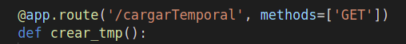
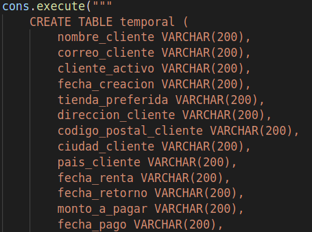
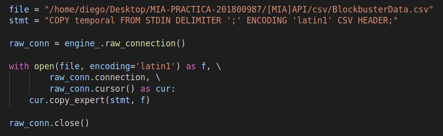
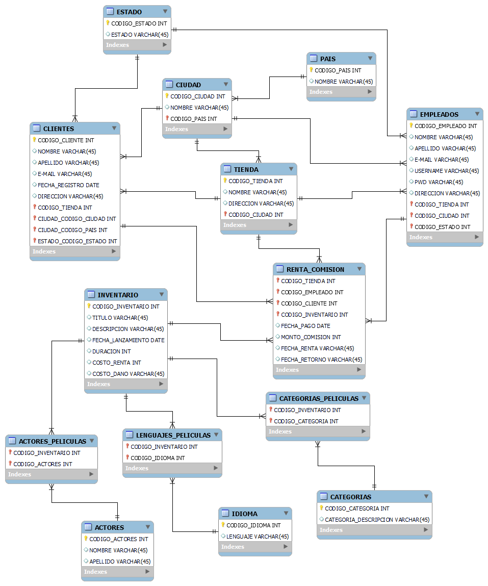

# CARGA MASIVA Y CREACION TABLA TEMPORAL

Para la carga y creacion de la tabla temporal y su informacion, se utilizo lo que fue una API REST para establecer comunicacion a la base de datos y hacer las consultas correspondientes por medio de peticiones.\
\
En primer instancia se configuro una aplicacion en Flask la cual servira como servidor intermedio y por medio de la libreria ***SQLALCHEMY*** se configuraron las consultas correspondientes para cargar el csv especificado y crear la tabla en donde se guardara la informacion del csv.\
\
De la siguiente manera se especifica la peticion en el servidor de flask para asi ser llamada desde postman o chrome:\

\
posteriormente se creo la tabla temporal a partir de la clase ***crear_tmp()*** la cual sera ejecutada al hacer el llamado de la peticion externamente.\
\
la consulta dirigida hacia la base de datos para que se cree la tabla temporal es la siguiente:\

***la imagen anterior es la representacion recortada de la consulta total***\
\
posteriormente en la misma clase se procedera a cargar los datos del csv hacia la tabla temporal desde la consulta **COPY ...** de la siguiente manera:\

\
\
RESULTADO:\

Siendo de esa manera la forma en la que se realizo la carga masiva de datos y para la creacion del modelo se siguio la misma mecanica.

\
\
El modelo relacional que define la estructura de la base de datos destino se define de la siguiente manera:\

